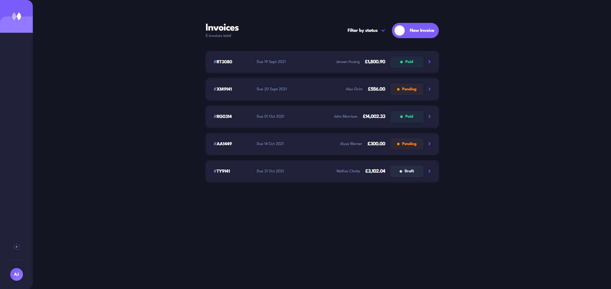

# Invoice Management App — Frontend Stage 2

A fully functional, responsive Invoice Management Application built with React and Vite.
Designed and developed based on the provided Figma specification.

---

## Live Demo

🔗 [View Live App](https://invoice-mgt.netlify.app/)

---

## Preview




---

## Tech Stack

| Tool | Purpose |
|------|---------|
| React 18 | UI component library |
| Vite | Build tool and dev server |
| JavaScript (ES6+) | Programming language |
| CSS (via JS injection) | Styling with CSS variables |
| LocalStorage | Data and theme persistence |
| Git + GitHub | Version control |
| Vercel | Deployment and hosting |

---

## Setup Instructions

### Prerequisites
Make sure you have the following installed:
- [Node.js](https://nodejs.org) (v18 or higher)
- [Git](https://git-scm.com)
- A code editor — [VS Code](https://code.visualstudio.com) recommended

### 1. Clone the Repository
```bash
git clone https://github.com/techjay01/invoice-management-app.git
cd invoice-management-app
```

### 2. Install Dependencies
```bash
npm install
```

### 3. Start the Development Server
```bash
npm run dev
```

### 4. Open in Browser
Navigate to: http://localhost:5173

### 5. Build for Production
```bash
npm run build
```

### 6. Preview Production Build
```bash
npm run preview
```

---

## Project Architecture

The project follows a clean, modular component structure for maximum reusability and maintainability.
```
src/
├── assets/
├── components/
│   ├── DeleteModal.jsx       # Confirmation modal for invoice deletion
│   ├── EmptyState.jsx        # Empty state illustration and message
│   ├── FilterDropdown.jsx    # Multi-select status filter dropdown
│   ├── Icons.jsx             # All SVG icon components in one place
│   ├── InvoiceCard.jsx       # Individual invoice card for list view
│   ├── InvoiceForm.jsx       # Create and edit invoice form (drawer)
│   ├── Sidebar.jsx           # App sidebar with logo and theme toggle
│   └── StatusBadge.jsx       # Reusable status badge (paid/pending/draft)
├── context/
│   └── ThemeContext.jsx      # Global theme state (dark/light mode)
├── pages/
│   ├── InvoiceDetailPage.jsx # Full invoice detail view
│   └── InvoiceListPage.jsx   # Invoice list with filter and header
├── utils/
│   └── helpers.js            # Utility functions and sample data
├── App.jsx                   # Root component — state and routing logic
└── main.jsx                  # React DOM entry point
```

### Key Architecture Decisions

**Context API for Theme**
Global theme state is managed via React Context, making it accessible
to any component without prop drilling.

**Utility Functions Centralised**
All helper functions (formatting, ID generation, date logic) live in
one file making them easy to test, maintain and reuse.

**Page vs Component Separation**
Pages handle layout and data flow. Components are purely presentational
and reusable — they receive props and render UI only.

**CSS via JS Injection**
All styles are injected dynamically via a custom `useGlobalStyles` hook
using CSS variables, enabling seamless dark/light theme switching
without any CSS file imports.

---

## Features Implemented

### Core CRUD
- ✅ Create new invoices with full form validation
- ✅ Read — view invoice list and full invoice detail
- ✅ Update — edit existing invoices with pre-filled form
- ✅ Delete — with confirmation modal before deletion

### Invoice Status Flow
- ✅ Save invoice as **Draft**
- ✅ Send invoice — Draft becomes **Pending**
- ✅ Mark invoice as **Paid**
- ✅ Paid invoices cannot be edited or reverted
- ✅ Status clearly shown in list and detail views

### Form Validation
- ✅ All required fields validated on submit
- ✅ Valid email format enforced
- ✅ At least one item required
- ✅ Quantity must be greater than zero
- ✅ Price must be a positive number
- ✅ Red error states with descriptive messages
- ✅ Draft saves bypass strict validation

### Filter
- ✅ Filter invoices by Draft, Pending or Paid
- ✅ Multi-select checkbox filter
- ✅ Empty state shown when no results match

### Theme
- ✅ Dark and light mode toggle
- ✅ Theme preference saved to LocalStorage
- ✅ Persists across page refreshes

### Responsiveness
- ✅ Mobile (320px+)
- ✅ Tablet (768px+)
- ✅ Desktop (1024px+)

### Data Persistence
- ✅ All invoices saved to LocalStorage
- ✅ Data survives page refresh
- ✅ Sample invoices loaded on first visit

---

## Accessibility Notes

This app was built with accessibility as a priority:

- **Semantic HTML** — proper use of `<nav>`, `<main>`, `<button>`, `<label>`
- **ARIA attributes** — `aria-label`, `aria-modal`, `aria-expanded`, `aria-haspopup`, `aria-invalid`, `aria-checked`, `aria-describedby` used throughout
- **Focus management** — focus is moved into drawer and modal on open
- **Keyboard navigation** — all interactive elements reachable and operable via keyboard
- **ESC key** — closes both the form drawer and delete modal
- **Screen reader support** — hidden semantic `<table>` in invoice detail for screen readers
- **Role attributes** — `role="dialog"`, `role="listbox"`, `role="alert"`, `role="list"` applied correctly
- **Color contrast** — WCAG AA compliant in both dark and light modes
- **Error announcements** — validation errors use `role="alert"` for screen reader announcement

---

## ⚖️Trade-offs & Decisions

### CSS-in-JS vs Separate CSS Files
**Decision**: CSS injected via a custom `useGlobalStyles` hook using a `<style>` tag.
**Reason**: Enables dynamic theme switching using CSS variables without needing
a CSS preprocessor or third-party library.
**Trade-off**: In a larger app, a dedicated solution like CSS Modules, Tailwind,
or Styled Components would be more scalable and maintainable.

### LocalStorage vs Backend
**Decision**: LocalStorage was used for data persistence.
**Reason**: Keeps the app self-contained with no backend dependency,
making it fast to set up and demo.
**Trade-off**: Data is device-specific and not shareable across browsers or users.
A real-world app would use a backend API with a database.

### React Context vs Redux
**Decision**: React Context API was used for theme state.
**Reason**: The app's global state is minimal (just theme). Context is
sufficient and avoids the overhead of Redux.
**Trade-off**: Context can cause unnecessary re-renders in very large apps.
Redux or Zustand would be better for complex shared state.

### Single Page (No React Router)
**Decision**: View switching is handled with a simple `view` state variable.
**Reason**: The app has only two views (list and detail), making a full
router unnecessary.
**Trade-off**: URLs don't change when navigating, so users can't bookmark
or share a specific invoice link. React Router would solve this.

---

## Possible Improvements Beyond Requirements

- **React Router** — proper URL-based navigation so each invoice has its own URL
- **Backend API** — Node/Express or Next.js API routes for real data persistence
- **Search functionality** — search invoices by client name, ID or description
- **Sorting** — sort invoices by date, amount or status
- **Pagination** — paginate invoice list for large datasets
- **PDF Export** — export individual invoices as downloadable PDFs
- **Email integration** — send invoice directly to client email
- **Authentication** — login system so multiple users can manage their own invoices
- **Animations** — page transition animations using Framer Motion
- **Unit Tests** — Jest and React Testing Library test coverage
- **PWA support** — make the app installable as a Progressive Web App
- **Multi-currency** — support currencies beyond GBP

---

## Author

- GitHub: [Mbamara Joshua — Jay Tech](https://github.com/YOUR_USERNAME)
- Email: techjay2023@gmail.com

---

## License

This project was built as part of a frontend developer assessment.


